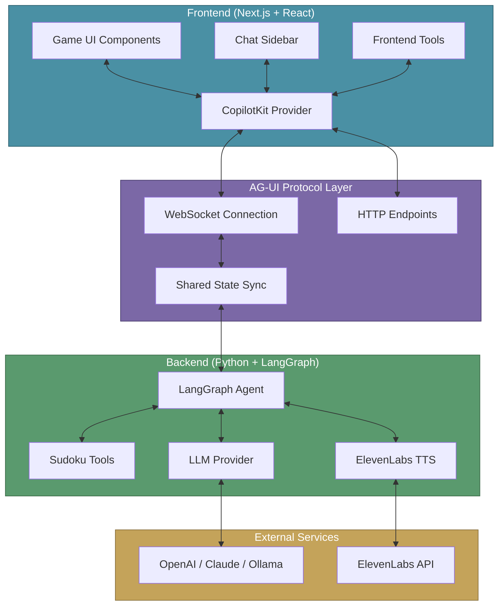
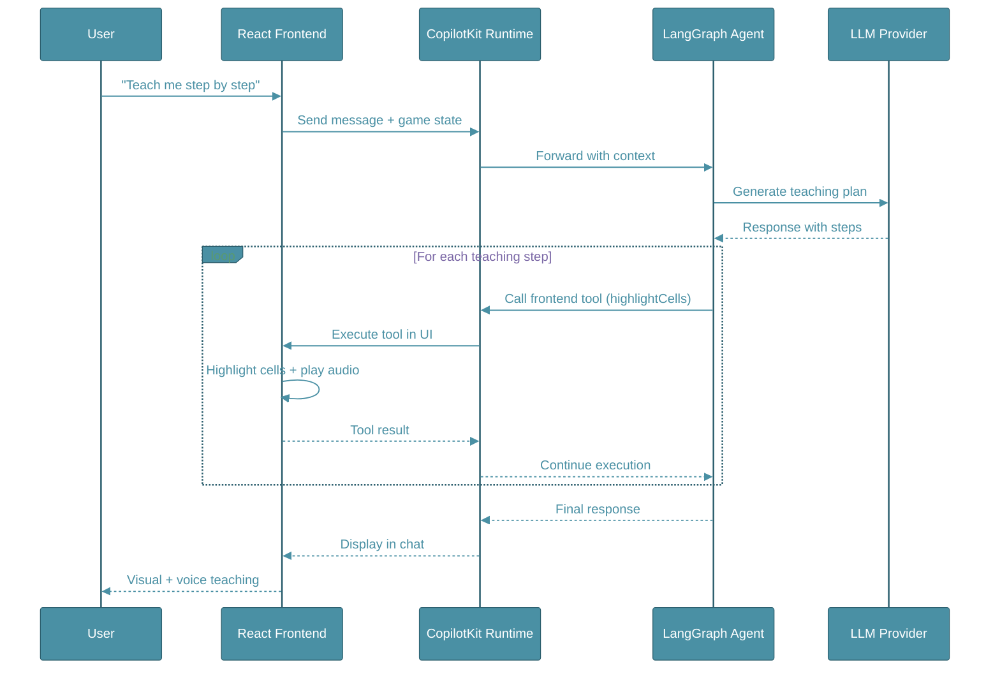
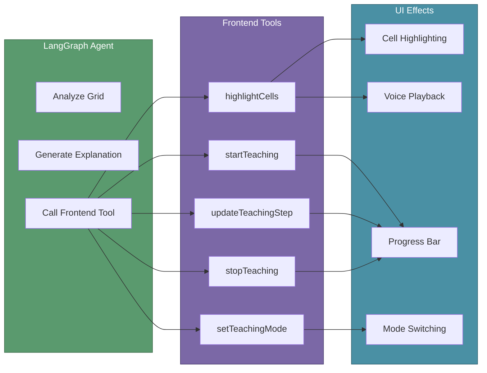
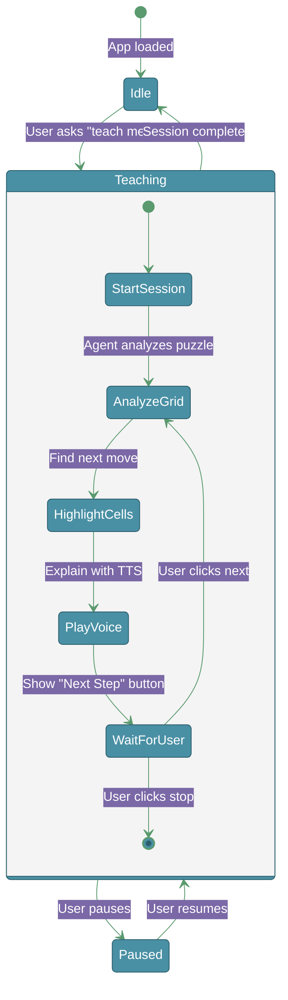

# LearnPlay.ai

**An intelligent educational platform that teaches classic board games through AI-powered interactive tutoring.**

LearnPlay.ai combines the timeless appeal of strategy games (Sudoku and Chess) with cutting-edge AI technology to create an engaging, personalized learning experience. Each game features an AI tutor that explains rules, demonstrates strategies, and teaches step-by-step solutions with interactive visual guidance and voice narration.

   

## Architecture

LearnPlay.ai uses a modern AI-first architecture with CopilotKit's AG-UI (Agent-User Interface) protocol enabling seamless communication between the React frontend and Python AI agent.

### System Architecture



### AG-UI Protocol Flow

The AG-UI (Agent-User Interface) protocol is the communication layer that enables real-time, bidirectional interaction between the AI agent and the user interface.



### How AG-UI Protocol Helps

| Feature | How AG-UI Enables It |
|---------|---------------------|
| **Real-time UI Updates** | Agent calls frontend tools (`highlightCells`, `startTeaching`) that directly manipulate React state |
| **Bidirectional State Sync** | Game grid state is shared with agent via `useCoAgent`, enabling context-aware responses |
| **Streaming Responses** | Messages stream token-by-token for natural conversation feel |
| **Tool Execution** | Agent can trigger UI actions (highlights, voice, progress bars) without page refresh |
| **Type Safety** | Shared TypeScript/Python schemas ensure consistent data structures |

### Frontend Tools (React → Agent)

The frontend exposes tools that the AI agent can call to control the UI:



### Data Flow Example: Teaching Session



### Technology Stack

- **Frontend**: React 19, Next.js 16, TypeScript 5
- **UI/Animations**: Tailwind CSS 4, Framer Motion
- **AI Integration**: CopilotKit 1.51 (AG-UI protocol)
- **Agent Framework**: LangGraph 1.0, LangChain 1.2
- **LLM Providers**: OpenAI, Azure OpenAI, Anthropic, Ollama

### Directory Structure

#### Frontend (Next.js + React)
```
src/
├── app/
│   ├── page.tsx              # Home page with game selector
│   ├── api/
│   │   ├── copilotkit/       # AG-UI protocol endpoint
│   │   └── tts/              # Text-to-speech API
│   └── sudoku/
│       └── page.tsx          # Sudoku game with CopilotKit
├── components/
│   └── sudoku/
│       ├── SudokuGame.tsx    # Main game component
│       ├── SudokuBoard.tsx   # Game board
│       ├── SudokuCell.tsx    # Individual cells
│       ├── NumberPad.tsx     # Number input
│       └── GameControls.tsx  # Controls & stats
└── lib/
    └── sudoku/
        ├── types.ts          # TypeScript types
        ├── generator.ts      # Puzzle generation
        ├── solver.ts         # Solving algorithms
        └── hooks.ts          # Game logic hooks
```

#### Backend (Python + LangGraph)
```
agent/
├── main.py               # LangGraph agent with CopilotKit
├── llm_provider.py       # Multi-LLM abstraction layer
├── sudoku_tools.py       # Sudoku analysis & teaching tools
├── tts_service.py        # ElevenLabs TTS integration
├── voice_tools.py        # Voice generation tools
└── pyproject.toml        # Python dependencies
```

## Features

### Sudoku Game (Fully Implemented)
- **Complete Game Mechanics**
  - Puzzle generation with 4 difficulty levels (Easy, Medium, Hard, Expert)
  - Interactive board with cell selection and number placement
  - Keyboard shortcuts and number pad input
  - Undo/Redo functionality with move history
  - Smart hint system with strategy-based suggestions
  - Real-time validation and error detection
  - Timer and mistake tracking

- **AI Teaching Features**
  - Interactive AI tutor with voice explanations (Eleven Labs TTS)
  - Structured teaching sessions with progress tracking
  - Visual cell highlighting with color-coded annotations
  - Step-by-step puzzle solving guidance
  - Strategy explanation (naked singles, hidden singles, etc.)
  - Adaptive difficulty based on player level
  - Pause/Resume/Stop controls for teaching sessions
  
- **Game Controls**
  - Start screen with difficulty selection
  - Pause/Resume game functionality
  - Stop game and return to start
  - New game with different difficulties
  - Reset current puzzle

### Chess Game (Planned)
- Chess board with piece movement
- Move validation and game rules
- AI opponent with adjustable difficulty
- Opening book and endgame tablebase
- Interactive AI chess tutor
- Position analysis and best move suggestions
- Step-by-step opening theory lessons

### AI Teaching Strategies

The AI tutor teaches these Sudoku techniques:

#### Beginner Level
- **Naked Single**: Only one number can go in a cell
- **Hidden Single**: A number can only go in one cell within a row/column/box

#### Intermediate Level
- **Naked Pair**: Two cells with same two candidates
- **Pointing Pair**: Candidates pointing to eliminate others

#### Advanced Level
- **X-Wing**: Advanced elimination pattern
- **Swordfish**: Complex pattern recognition
- **XY-Wing**: Chain-based technique

## Quick Start

### Prerequisites
- Node.js 20+
- Python 3.12+
- OpenAI API key (or other LLM provider)

### Installation

1. **Clone and install dependencies:**
```bash
cd gameleraning
npm install
```

2. **Configure LLM Provider:**

Edit `agent/.env` and add your API keys:
```env
LLM_PROVIDER=openai
OPENAI_API_KEY=your-key-here
OPENAI_MODEL=gpt-4o-mini

# Optional: ElevenLabs for voice teaching (free tier available)
ELEVENLABS_API_KEY=your-elevenlabs-key
```

For other providers, see [LLM Configuration](#llm-configuration) below.

3. **Start the development servers:**
```bash
npm run dev
```

This starts both:
- Frontend (Next.js): http://localhost:3000
- Agent (LangGraph): http://localhost:8123

4. **Open the app:**
Navigate to http://localhost:3000 and start playing!

## How to Play Sudoku

1. Click any cell to select it
2. Use number pad or keyboard (1-9) to place numbers
3. Press Delete/Backspace to clear a cell
4. Use arrow keys to navigate
5. Click "Hint" if you need help
6. Chat with the AI tutor for strategy explanations!

## LLM Configuration

### OpenAI (Default)
```env
LLM_PROVIDER=openai
OPENAI_API_KEY=sk-...
OPENAI_MODEL=gpt-4o-mini
```

### Azure OpenAI
```env
LLM_PROVIDER=azure-openai
AZURE_OPENAI_API_KEY=your-key
AZURE_OPENAI_ENDPOINT=https://your-endpoint.openai.azure.com/
AZURE_OPENAI_DEPLOYMENT=gpt-4o
```

### Anthropic Claude
```env
LLM_PROVIDER=anthropic
ANTHROPIC_API_KEY=sk-ant-...
ANTHROPIC_MODEL=claude-3-5-sonnet-20241022
```

### Ollama (Local)
```env
LLM_PROVIDER=ollama
OLLAMA_BASE_URL=http://localhost:11434
OLLAMA_MODEL=llama3.1:8b
```

## Voice Configuration (ElevenLabs)

LearnPlay.ai uses ElevenLabs for natural voice explanations during teaching sessions.

### Setup

1. **Get an API key** from [ElevenLabs](https://elevenlabs.io/) (free tier available)
2. **Add to `agent/.env`**:

```env
ELEVENLABS_API_KEY=your-elevenlabs-api-key
ELEVENLABS_VOICE_ID=JBFqnCBsd6RMkjVDRZzb  # Optional, defaults to "George"
```

### Voice Settings

| Setting | Default | Description |
|---------|---------|-------------|
| Voice ID | `JBFqnCBsd6RMkjVDRZzb` | George voice (free tier) |
| Model | `eleven_multilingual_v2` | Multilingual support |
| Stability | `0.5` | Voice consistency |
| Similarity Boost | `0.75` | Voice clarity |
| Output Format | MP3 44100Hz | High quality audio |

### Available Voices

You can use any ElevenLabs voice ID. Popular free-tier options:
- `JBFqnCBsd6RMkjVDRZzb` - George (default, male)
- `21m00Tcm4TlvDq8ikWAM` - Rachel (female)
- `AZnzlk1XvdvUeBnXmlld` - Domi (female)

### Fallback Behavior

If ElevenLabs is not configured or unavailable:
- The app gracefully falls back to browser's built-in Text-to-Speech
- Teaching sessions continue without interruption
- A message indicates TTS is unavailable

## Development

### Run in debug mode:
```bash
npm run dev:debug
```

### Build for production:
```bash
npm run build
npm start
```

### Lint code:
```bash
npm run lint
```

## Scripts

- `npm run dev` - Start both frontend and agent
- `npm run dev:ui` - Start frontend only
- `npm run dev:agent` - Start agent only
- `npm run build` - Build for production
- `npm run lint` - Lint code

## Roadmap

### Phase 1: Sudoku MVP (Complete)
- [x] Basic Sudoku game
- [x] LangGraph agent
- [x] CopilotKit integration
- [x] Multi-LLM support

### Phase 2: Enhanced Teaching (In Progress)
- [x] Teaching modes
- [x] Strategy analysis
- [ ] Generative UI for explanations
- [ ] Progress tracking

### Phase 3: Chess Implementation (Planned)
- [ ] Chess game engine
- [ ] Move validation
- [ ] AI opponent
- [ ] Chess teaching agent

### Phase 4: Advanced Features (Planned)
- [x] Voice mode (ElevenLabs TTS)
- [ ] User accounts
- [ ] Leaderboards
- [ ] Mobile app

## Contributing

This is a learning project! Contributions welcome.

## License

MIT

## Acknowledgments

- CopilotKit for the amazing AI framework
- LangChain/LangGraph for agent orchestration
- The Sudoku and Chess communities for strategy documentation

---

Built with CopilotKit and LangGraph
