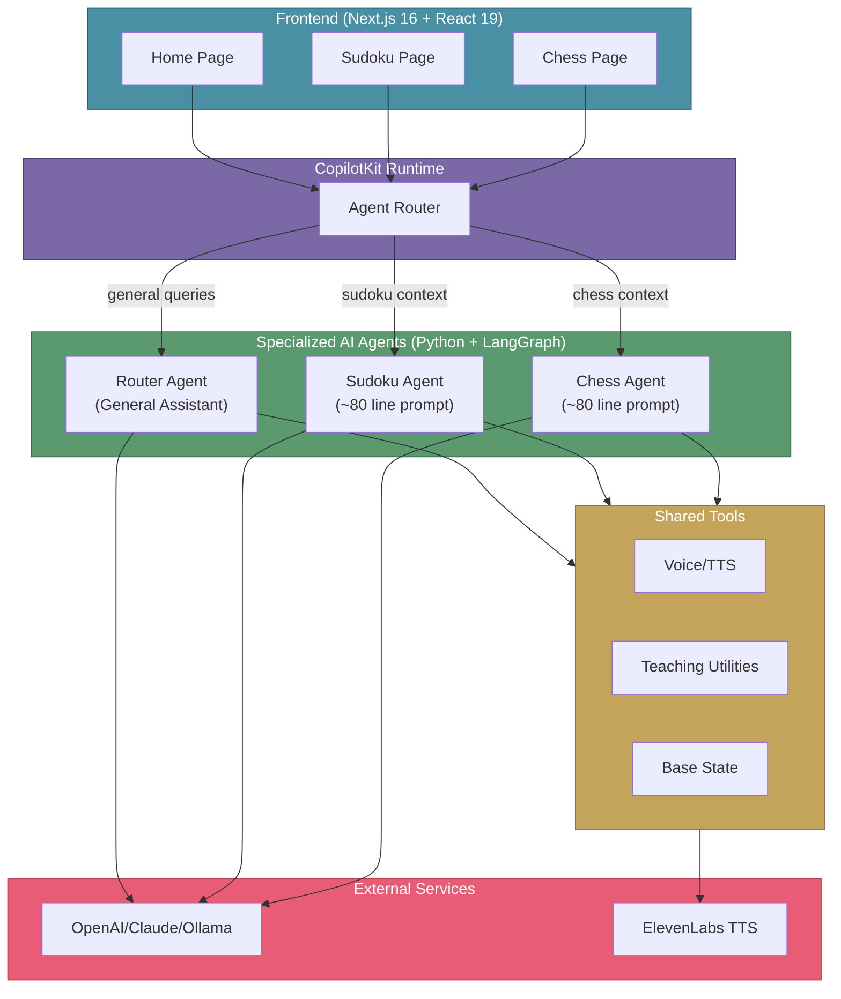

# LearnPlay.ai

**AI-powered educational platform that teaches strategy games through interactive tutoring.**

LearnPlay.ai uses cutting-edge AI agents to teach classic board games (Sudoku and Chess) with real-time guidance, visual highlights, and voice explanations. Each game has a specialized AI tutor that adapts to your skill level and teaches step-by-step.

   

## Project Overview

### What's Working Now
- **Sudoku Game**: Complete with 4 difficulty levels and AI tutor
- **Multi-Agent System**: Specialized agents for each game
- **Voice Teaching**: Natural voice explanations (ElevenLabs TTS)
- **Multi-LLM Support**: Works with OpenAI, Anthropic, Azure OpenAI, Ollama
- **Interactive Guidance**: Visual highlights and step-by-step lessons

### Coming Soon
- **Chess Game**: Full chess implementation with AI opponent
- **User Authentication**: Save progress and track learning
- **Mobile Support**: Responsive design for tablets and phones

---

## Architecture

LearnPlay.ai uses a **Multi-Agent Architecture** where specialized AI agents handle specific games, orchestrated through **CopilotKit's AG-UI protocol** for seamless frontend-backend communication.




### Technology Stack

- **Frontend**: Next.js 16, React 19, TypeScript, Tailwind CSS
- **AI Framework**: CopilotKit 1.51, LangGraph 1.0, LangChain
- **LLM Providers**: OpenAI, Anthropic Claude, Azure OpenAI, Ollama
- **Voice**: ElevenLabs Text-to-Speech

**Detailed architecture guide:** [docs/AGENT_ARCHITECTURE_RECOMMENDATIONS.md](docs/AGENT_ARCHITECTURE_RECOMMENDATIONS.md)

---

## Installation

### Prerequisites

- **Node.js** 20+ ([Download](https://nodejs.org/))
- **Python** 3.12+ ([Download](https://www.python.org/))
- **OpenAI API Key** (or other LLM provider) ([Get Key](https://platform.openai.com/api-keys))

### Step 1: Clone and Install

```bash
# Clone the repository
git clone https://github.com/nitin27may/learnplay-ai.git
cd learnplay-ai

# Install all dependencies (frontend + backend)
npm install
```

The `postinstall` script automatically sets up the Python environment using `uv`.

### Step 2: Configure API Keys

Create or edit `agent/.env`:

```env
# Required: LLM Provider
OPENAI_API_KEY=sk-proj-your-key-here
OPENAI_MODEL=gpt-4o-mini

# Optional: Voice (get free key at elevenlabs.io)
ELEVENLABS_API_KEY=your-elevenlabs-key
ELEVENLABS_VOICE_ID=JBFqnCBsd6RMkjVDRZzb
```

**Other LLM Providers:**

<details>
<summary>Anthropic Claude</summary>

```env
LLM_PROVIDER=anthropic
ANTHROPIC_API_KEY=sk-ant-your-key
ANTHROPIC_MODEL=claude-3-5-sonnet-20241022
```
</details>

<details>
<summary>Azure OpenAI</summary>

```env
LLM_PROVIDER=azure-openai
AZURE_OPENAI_API_KEY=your-key
AZURE_OPENAI_ENDPOINT=https://your-resource.openai.azure.com/
AZURE_OPENAI_DEPLOYMENT=gpt-4o
```
</details>

<details>
<summary>Ollama (Local)</summary>

```env
LLM_PROVIDER=ollama
OLLAMA_BASE_URL=http://localhost:11434
OLLAMA_MODEL=llama3.1:8b
```
</details>

---

## Running the Application

### Start Everything

```bash
npm run dev
```

This starts:
- **Frontend**: [http://localhost:3000](http://localhost:3000)
- **Agent Server**: [http://localhost:8123](http://localhost:8123)

**That's it!** Open your browser and start learning Sudoku with AI guidance.

### Run Separately (Optional)

If you need to run frontend and backend separately:

```bash
# Terminal 1 - Frontend only
npm run dev:ui

# Terminal 2 - Agent server only
npm run dev:agent
```

### Verify Setup

After starting, you should see:

```
✓ Router agent registered
✓ Sudoku agent registered
✓ Chess agent registered
```

Navigate to [http://localhost:3000/sudoku](http://localhost:3000/sudoku) and click "Learn Sudoku Basics" to test the AI tutor.

---

## How to Use

### Playing Sudoku

1. **Start a Game**: Select difficulty (Easy/Medium/Hard/Expert)
2. **Make Moves**: Click cells and use number pad (1-9) or keyboard
3. **Get Help**: Click chat icon and ask: "Explain the basics" or "Give me a hint"
4. **Learn Strategies**: Use "Learn Sudoku Basics" button for step-by-step teaching

### AI Teaching Features

- **Visual Highlights**: Agent highlights cells with different colors
- **Voice Explanations**: Natural voice guidance (optional)
- **Step-by-Step Lessons**: Progress through teaching sessions
- **Strategy Analysis**: Learn techniques like Naked Singles, X-Wing, etc.

**Complete usage guide:** [docs/SETUP.md](docs/SETUP.md)


---

## Documentation

### For Users
- **[Setup Guide](docs/SETUP.md)** - Detailed configuration, gameplay, and LLM providers
- **[Sudoku Guide](docs/SUDOKU_GUIDE.md)** - Sudoku strategies and techniques
- **[Chess Guide](docs/CHESS_GUIDE.md)** - Chess gameplay (coming soon)

### For Developers
- **[Quick Start](docs/QUICKSTART.md)** - Multi-agent setup and testing
- **[Architecture](docs/AGENT_ARCHITECTURE_RECOMMENDATIONS.md)** - Multi-agent design patterns
- **[AI Teaching System](docs/AI_TEACHING.md)** - Teaching patterns and behavior
- **[Security](docs/SECURITY_AUDIT.md)** - Security hardening guide
- **[Development Plan](PLAN.md)** - Roadmap and task tracking

---

## Roadmap

### Completed
- [x] Sudoku game with 4 difficulty levels
- [x] Multi-agent architecture (Router, Sudoku, Chess)
- [x] Interactive AI tutor with teaching sessions
- [x] Voice mode (ElevenLabs TTS)
- [x] Multi-LLM support (OpenAI, Claude, Azure, Ollama)
- [x] Visual highlights and step-by-step guidance

### In Progress
- [ ] Security hardening (authentication, rate limiting)
- [ ] Chess game implementation

### Planned
- [ ] User accounts and progress tracking
- [ ] Achievement system and leaderboards
- [ ] Mobile app
- [ ] More games (Go, Checkers)

**See [PLAN.md](PLAN.md) for detailed task tracking with 40+ tasks organized by phase.**

---

## Development

```bash
# Run both frontend and agent
npm run dev

# Run separately
npm run dev:ui      # Frontend only (port 3000)
npm run dev:agent   # Agent server only (port 8123)

# Build for production
npm run build

# Lint code
npm run lint
```

### Project Structure

```
learnplay-ai/
├── src/                    # Frontend (Next.js + React)
│   ├── app/               # Pages (home, sudoku, chess)
│   ├── components/        # UI components
│   └── lib/               # Game logic and utilities
│
├── agent/                 # Backend (Python + LangGraph)
│   ├── agents/           # Specialized agents
│   │   ├── router_agent.py
│   │   ├── sudoku/       # Sudoku agent
│   │   └── chess/        # Chess agent
│   └── shared/           # Shared tools (voice, TTS, state)
│
└── docs/                  # Documentation
```

---

## Contributing

Contributions welcome! This is a learning project demonstrating:
- Multi-agent AI architecture
- CopilotKit integration
- LangGraph agent orchestration
- Interactive teaching systems

Feel free to:
- Report bugs
- Suggest features
- Submit pull requests
- Share feedback

---

## License

MIT License - see [LICENSE](LICENSE) file for details.

---

## Acknowledgments

- **[CopilotKit](https://copilotkit.ai/)** - Amazing AI framework for building AI agents
- **[LangChain](https://langchain.com/)** / **[LangGraph](https://langchain-ai.github.io/langgraph/)** - Agent orchestration
- **Sudoku & Chess communities** - Strategy documentation and teaching methods

---

<div align="center">

**Built with ❤️ using CopilotKit and LangGraph**

[Star this repo](https://github.com/nitin27may/learnplay-ai) | [Read the docs](docs/) | [Report an issue](https://github.com/nitin27may/learnplay-ai/issues)

</div>
