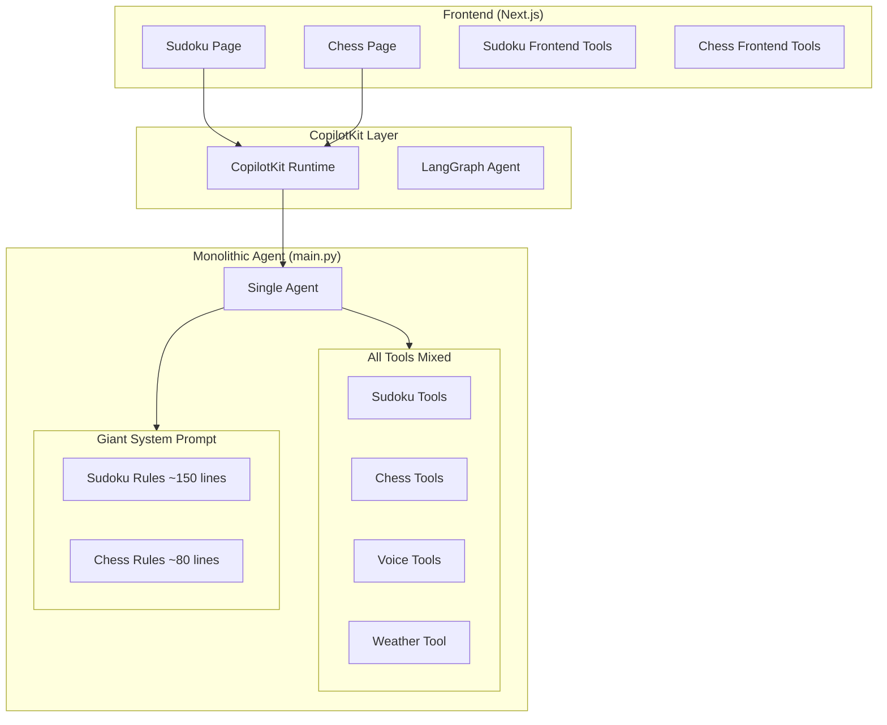
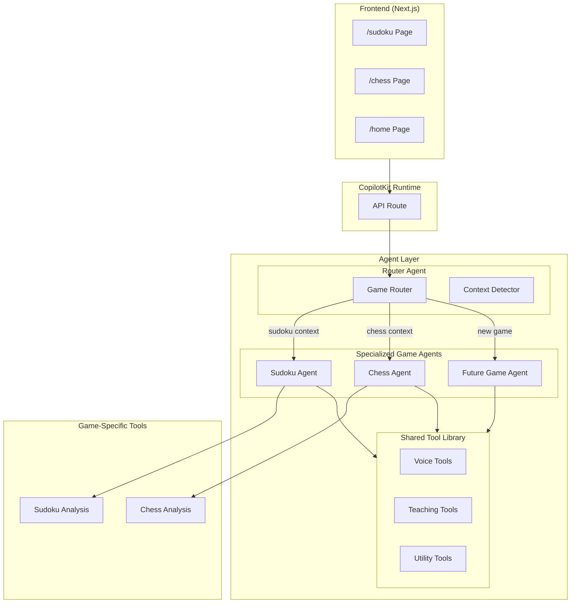
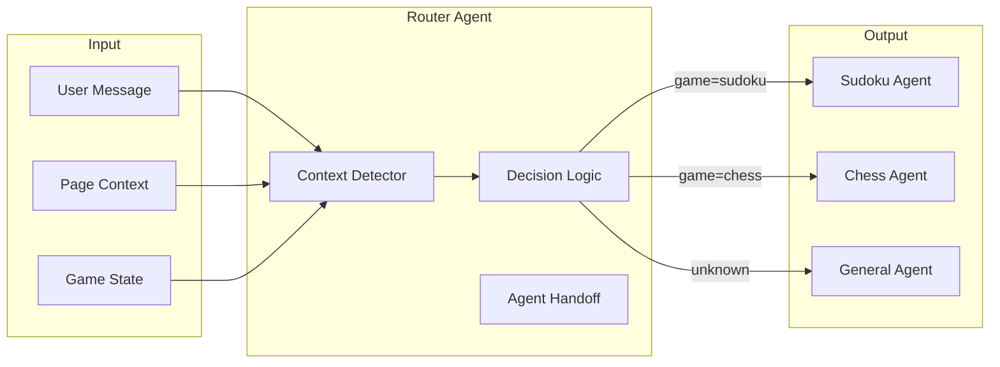
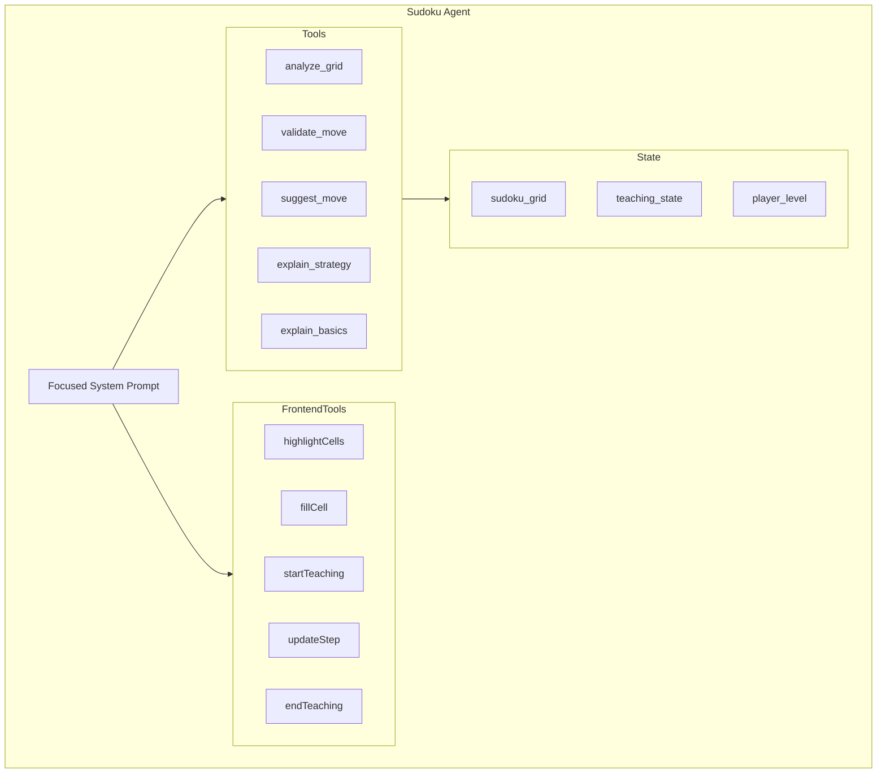
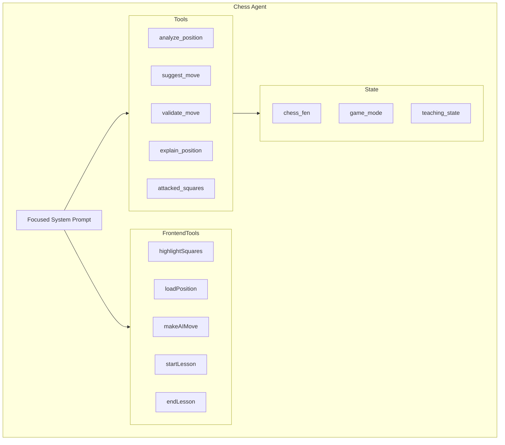
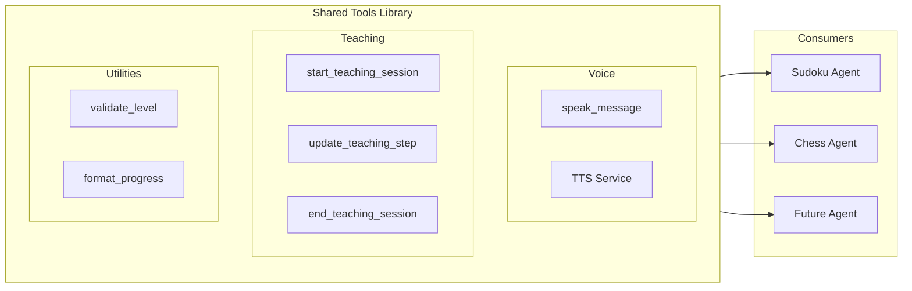
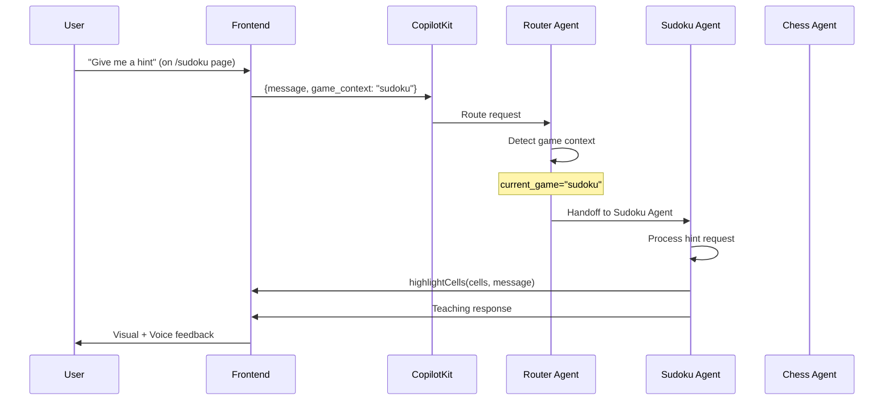
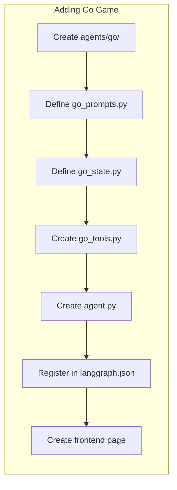

# Agent Architecture Recommendations

## Executive Summary

This document provides a comprehensive analysis of the current LearnPlay.ai agent architecture and recommends a refactored **Multi-Agent Agentic Workflow** to improve modularity, maintainability, and scalability. The key recommendation is to split the monolithic agent into specialized game agents orchestrated by a router agent, with shared tooling for common functionality.

---

## Current Architecture Analysis

### Current State



### Problems Identified

| Issue | Description | Impact |
|-------|-------------|--------|
| **Monolithic Prompt** | System prompt is ~230 lines mixing Sudoku and Chess teaching logic | Hard to maintain, test, and update individual game logic |
| **No Context Routing** | Same agent handles both games with all tools loaded | Token waste, potential tool confusion, slower responses |
| **Tight Coupling** | Game-specific logic embedded in single agent | Cannot update one game without touching the other |
| **Prompt Sprawl** | Adding new games requires expanding the monolithic prompt | Doesn't scale, increases error rates |
| **No Agent Specialization** | Generic agent tries to be expert at everything | Reduced quality of specialized teaching |
| **Duplicate State Schema** | Single `AgentState` mixes Sudoku and Chess fields | Confusing, wasteful, hard to extend |

---

## Proposed Architecture

### Multi-Agent Agentic Workflow



### Architecture Benefits

| Benefit | Description |
|---------|-------------|
| **Single Responsibility** | Each agent focuses on one game domain |
| **Easy Updates** | Change Sudoku prompts without touching Chess |
| **Scalable** | Add new games by creating new specialized agents |
| **Testable** | Test each agent in isolation |
| **Smaller Prompts** | Focused prompts = better LLM performance |
| **Context-Aware Routing** | Only load relevant tools for each game |
| **Shared Logic Reuse** | Voice, teaching patterns reused across agents |

---

## Detailed Design

### 1. Router Agent

The Router Agent determines which specialized agent to invoke based on:
- Current page context (URL/route)
- User message content
- Active game state



**Router Agent Responsibilities:**
- Detect game context from frontend state
- Route to appropriate specialized agent
- Handle cross-game queries ("Which game should I learn first?")
- Provide fallback responses for general questions

**Proposed Router System Prompt:**
```python
ROUTER_SYSTEM_PROMPT = """You are a game learning platform router.

Your job is to:
1. Detect which game the user is asking about (sudoku, chess, or general)
2. Route to the appropriate specialized agent
3. Handle general questions about the platform

Context Detection:
- Check the 'current_game' field in state
- Analyze user message for game-specific keywords
- If unclear, ask the user which game they want help with

Routing:
- Sudoku: grid, cells, boxes, rows, columns, numbers 1-9
- Chess: pieces, moves, positions, checkmate, opening, endgame
- General: greetings, platform questions, game comparisons
"""
```

### 2. Sudoku Agent

Specialized agent for Sudoku teaching with focused system prompt.



**Sudoku Agent Files:**
```
agent/
├── agents/
│   ├── __init__.py
│   ├── sudoku_agent.py      # Sudoku-specific agent
│   ├── sudoku_prompts.py    # Sudoku system prompts
│   └── sudoku_state.py      # Sudoku state schema
```

### 3. Chess Agent

Specialized agent for Chess teaching.



**Chess Agent Files:**
```
agent/
├── agents/
│   ├── chess_agent.py       # Chess-specific agent
│   ├── chess_prompts.py     # Chess system prompts
│   └── chess_state.py       # Chess state schema
```

### 4. Shared Tools Library

Reusable tools shared across all game agents.



---

## File Structure

### Proposed Directory Layout

```
agent/
├── main.py                    # Entry point - Router Agent
├── langgraph.json             # Graph configuration
├── pyproject.toml
├── llm_provider.py            # LLM configuration (unchanged)
│
├── agents/                    # Specialized agents
│   ├── __init__.py
│   ├── router_agent.py        # Routes to game-specific agents
│   ├── sudoku/
│   │   ├── __init__.py
│   │   ├── agent.py           # Sudoku agent definition
│   │   ├── prompts.py         # Sudoku system prompts
│   │   ├── state.py           # Sudoku state schema
│   │   └── tools.py           # Sudoku-specific tools
│   │
│   └── chess/
│       ├── __init__.py
│       ├── agent.py           # Chess agent definition
│       ├── prompts.py         # Chess system prompts
│       ├── state.py           # Chess state schema
│       └── tools.py           # Chess-specific tools
│
├── shared/                    # Shared components
│   ├── __init__.py
│   ├── voice_tools.py         # TTS tools
│   ├── tts_service.py         # Eleven Labs service
│   ├── teaching_tools.py      # Common teaching patterns
│   └── base_state.py          # Base state schema
│
└── tests/                     # Agent tests
    ├── test_router.py
    ├── test_sudoku_agent.py
    └── test_chess_agent.py
```

---

## Implementation Details

### Router Agent Implementation

```python
# agent/agents/router_agent.py

from langchain.tools import tool
from copilotkit import CopilotKitState

class RouterState(CopilotKitState):
    """State for the router agent."""
    current_game: str = "unknown"  # sudoku, chess, or unknown
    user_message: str = ""

ROUTER_PROMPT = """You are a learning platform router.

Analyze the context and route to the appropriate game agent:
- If current_game is 'sudoku' or message mentions sudoku concepts → route to sudoku_agent
- If current_game is 'chess' or message mentions chess concepts → route to chess_agent  
- If unclear → ask clarifying question

Available agents:
- sudoku_agent: For all Sudoku teaching and gameplay
- chess_agent: For all Chess teaching and gameplay

Always respond with a routing decision or clarifying question.
"""

@tool
def route_to_sudoku():
    """Route the conversation to the Sudoku teaching agent."""
    return {"next_agent": "sudoku_agent"}

@tool
def route_to_chess():
    """Route the conversation to the Chess teaching agent."""
    return {"next_agent": "chess_agent"}
```

### Sudoku Agent Implementation

```python
# agent/agents/sudoku/agent.py

from langchain.agents import create_agent
from copilotkit import CopilotKitMiddleware
from .prompts import SUDOKU_SYSTEM_PROMPT
from .state import SudokuAgentState
from .tools import (
    analyze_sudoku_grid,
    validate_move,
    suggest_next_move,
    explain_strategy,
    explain_sudoku_basics
)
from shared.voice_tools import speak_message

sudoku_agent = create_agent(
    model=get_llm_provider(),
    tools=[
        analyze_sudoku_grid,
        validate_move,
        suggest_next_move,
        explain_strategy,
        explain_sudoku_basics,
        speak_message
    ],
    middleware=[CopilotKitMiddleware()],
    state_schema=SudokuAgentState,
    system_prompt=SUDOKU_SYSTEM_PROMPT
)
```

### Sudoku Prompts (Separated)

```python
# agent/agents/sudoku/prompts.py

SUDOKU_SYSTEM_PROMPT = """You are an expert Sudoku tutor.

## Single-Step Teaching Pattern
LLMs are stateless - deliver ONE STEP per user message, then STOP.

## Available Frontend Tools
- startTeaching(totalSteps, topic)
- updateTeachingStep(stepNumber, description)
- endTeaching()
- highlightCells(cells, message)
- clearHighlights()
- getCurrentGrid()
- getNextSolvingMove()
- fillCell(row, col, value)
- analyzeWrongMove()

## Teaching Workflows
[... Sudoku-specific teaching patterns ...]
"""
```

### Chess Agent Implementation

```python
# agent/agents/chess/agent.py

from langchain.agents import create_agent
from copilotkit import CopilotKitMiddleware
from .prompts import CHESS_SYSTEM_PROMPT
from .state import ChessAgentState
from .tools import (
    analyze_chess_position,
    suggest_chess_move,
    validate_chess_move,
    explain_chess_position,
    get_attacked_squares
)
from shared.voice_tools import speak_message

chess_agent = create_agent(
    model=get_llm_provider(),
    tools=[
        analyze_chess_position,
        suggest_chess_move,
        validate_chess_move,
        explain_chess_position,
        get_attacked_squares,
        speak_message
    ],
    middleware=[CopilotKitMiddleware()],
    state_schema=ChessAgentState,
    system_prompt=CHESS_SYSTEM_PROMPT
)
```

---

## State Management

### Base State Schema

```python
# agent/shared/base_state.py

from typing import Optional
from copilotkit import CopilotKitState

class BaseTeachingState(CopilotKitState):
    """Base state for all teaching agents."""
    # Teaching session tracking
    teaching_active: bool = False
    teaching_topic: str = ""
    teaching_current_step: int = 0
    teaching_total_steps: int = 0
    next_step_requested: bool = False
    
    # Player info
    player_level: str = "beginner"
```

### Game-Specific States

```python
# agent/agents/sudoku/state.py

from shared.base_state import BaseTeachingState

class SudokuAgentState(BaseTeachingState):
    """State specific to Sudoku agent."""
    sudoku_grid: Optional[List[List[Optional[int]]]] = None
    last_move: Optional[Dict[str, Any]] = None
    teaching_mode: str = "play"
```

```python
# agent/agents/chess/state.py

from shared.base_state import BaseTeachingState

class ChessAgentState(BaseTeachingState):
    """State specific to Chess agent."""
    chess_fen: Optional[str] = None
    chess_game_mode: str = "practice"
    last_chess_move: Optional[str] = None
```

---

## Routing Flow



---

## Frontend Integration

### Context Injection

Each game page should inject game context:

```typescript
// src/app/sudoku/page.tsx
const { state, setState } = useCoAgent({
  name: 'router_agent',  // Route through router
  initialState: {
    current_game: 'sudoku',  // Inject game context
  }
});
```

```typescript
// src/app/chess/page.tsx
const { state, setState } = useCoAgent({
  name: 'router_agent',
  initialState: {
    current_game: 'chess',
  }
});
```

### Alternative: Direct Agent Routing

For simpler deployment, skip the router and use direct agent names:

```typescript
// src/app/sudoku/page.tsx
const { state, setState } = useCoAgent({
  name: 'sudoku_agent',  // Direct to Sudoku agent
});

// src/app/chess/page.tsx  
const { state, setState } = useCoAgent({
  name: 'chess_agent',  // Direct to Chess agent
});
```

This requires updating the CopilotKit runtime configuration:

```typescript
// src/app/api/copilotkit/route.ts
const runtime = new CopilotRuntime({
  agents: {
    sudoku_agent: new LangGraphAgent({
      deploymentUrl: process.env.LANGGRAPH_DEPLOYMENT_URL,
      graphId: "sudoku_agent",
    }),
    chess_agent: new LangGraphAgent({
      deploymentUrl: process.env.LANGGRAPH_DEPLOYMENT_URL,
      graphId: "chess_agent",
    }),
    router_agent: new LangGraphAgent({
      deploymentUrl: process.env.LANGGRAPH_DEPLOYMENT_URL,
      graphId: "router_agent",
    }),
  },
});
```

---

## LangGraph Configuration

### Updated langgraph.json

```json
{
  "python_version": "3.12",
  "dependencies": ["."],
  "package_manager": "uv",
  "graphs": {
    "router_agent": "./agents/router_agent.py:graph",
    "sudoku_agent": "./agents/sudoku/agent.py:graph",
    "chess_agent": "./agents/chess/agent.py:graph"
  },
  "env": ".env"
}
```

---

## Migration Strategy

### Phase 1: Extract Shared Tools (Low Risk)
1. Create `shared/` directory
2. Move `voice_tools.py` and `tts_service.py` to shared
3. Create base state class
4. Update imports in `main.py`
5. **Test:** Ensure existing functionality works

### Phase 2: Create Sudoku Agent (Medium Risk)
1. Create `agents/sudoku/` directory structure
2. Extract Sudoku prompts to `prompts.py`
3. Extract Sudoku state to `state.py`
4. Move Sudoku tools to `tools.py`
5. Create Sudoku agent with focused prompt
6. **Test:** Sudoku page against new agent

### Phase 3: Create Chess Agent (Medium Risk)
1. Create `agents/chess/` directory structure
2. Extract Chess prompts and state
3. Create Chess agent
4. **Test:** Chess page against new agent

### Phase 4: Implement Router (Higher Risk)
1. Create router agent with routing logic
2. Update frontend to use game context
3. Update CopilotKit runtime configuration
4. **Test:** Full workflow with routing

### Phase 5: Cleanup (Low Risk)
1. Remove old monolithic agent code
2. Update documentation
3. Add agent tests

---

## Testing Strategy

### Unit Tests

```python
# agent/tests/test_sudoku_agent.py

def test_sudoku_grid_analysis():
    """Test that Sudoku agent can analyze grids."""
    grid = [[5,3,None,...], ...]
    result = analyze_sudoku_grid(grid)
    assert "strategies_found" in result

def test_sudoku_teaching_flow():
    """Test teaching session state management."""
    state = SudokuAgentState(teaching_active=True)
    assert state.teaching_active == True
```

### Integration Tests

```python
# agent/tests/test_routing.py

def test_router_detects_sudoku():
    """Test that router correctly identifies Sudoku context."""
    state = RouterState(current_game="sudoku")
    result = router.invoke({"message": "give me a hint"})
    assert result["next_agent"] == "sudoku_agent"

def test_router_detects_chess():
    """Test that router correctly identifies Chess context."""
    state = RouterState(current_game="chess")
    result = router.invoke({"message": "suggest a move"})
    assert result["next_agent"] == "chess_agent"
```

---

## Benefits Summary

| Metric | Before | After |
|--------|--------|-------|
| System Prompt Size | ~230 lines (mixed) | ~80 lines per agent (focused) |
| Tools per Agent | 12 (all loaded) | 6-7 (game-specific) |
| State Fields | 12 (mixed) | 5-6 per agent |
| Adding New Game | Modify monolith | Add new agent folder |
| Prompt Updates | Risk breaking both games | Isolated to one agent |
| Testing | Hard (tightly coupled) | Easy (isolated agents) |
| Token Usage | Higher (unused context) | Lower (focused context) |

---

## Considerations

### Trade-offs

| Approach | Pros | Cons |
|----------|------|------|
| **Router Agent** | Dynamic routing, single entry point, handles cross-game queries | Additional latency, more complex deployment |
| **Direct Agent Names** | Simpler, lower latency, easier to debug | Page-specific setup, can't handle cross-game queries |
| **Hybrid** | Best of both - use direct for known games, router for general | More agents to maintain |

### Recommendation

**Start with Direct Agent Names** for v1, then add Router Agent when:
- You have 3+ games
- Users frequently ask cross-game questions
- You need a unified home page chat experience

---

## Future Extensibility

### Adding a New Game (e.g., Go)



**Steps:**
1. Create `agent/agents/go/` directory
2. Define Go-specific prompts, state, and tools
3. Add `go_agent` to `langgraph.json`
4. Add `GoAgent` to CopilotKit runtime
5. Create `/go` page with frontend tools
6. **No changes to Sudoku or Chess agents!**

---

## TODO Checklist

### Phase 1: Foundation (Week 1)
- [ ] Create `agent/shared/` directory
- [ ] Move `voice_tools.py` to `shared/`
- [ ] Move `tts_service.py` to `shared/`
- [ ] Create `shared/base_state.py` with common teaching state
- [ ] Create `shared/teaching_tools.py` for common teaching patterns
- [ ] Update imports in existing `main.py`
- [ ] Verify existing functionality still works

### Phase 2: Sudoku Agent (Week 2)
- [ ] Create `agent/agents/sudoku/` directory structure
- [ ] Create `agent/agents/sudoku/__init__.py`
- [ ] Extract Sudoku system prompt to `sudoku/prompts.py`
- [ ] Extract Sudoku state to `sudoku/state.py`
- [ ] Move Sudoku tools to `sudoku/tools.py`
- [ ] Create `sudoku/agent.py` with focused Sudoku agent
- [ ] Update `langgraph.json` to register `sudoku_agent`
- [ ] Update Sudoku page to use `sudoku_agent`
- [ ] Test Sudoku teaching flow end-to-end

### Phase 3: Chess Agent (Week 3)
- [ ] Create `agent/agents/chess/` directory structure
- [ ] Create `agent/agents/chess/__init__.py`
- [ ] Extract Chess system prompt to `chess/prompts.py`
- [ ] Extract Chess state to `chess/state.py`
- [ ] Move Chess tools to `chess/tools.py`
- [ ] Create `chess/agent.py` with focused Chess agent
- [ ] Update `langgraph.json` to register `chess_agent`
- [ ] Update CopilotKit runtime to include both agents
- [ ] Update Chess page to use `chess_agent`
- [ ] Test Chess teaching flow end-to-end

### Phase 4: Router Agent (Week 4) - Optional
- [ ] Create `agent/agents/router_agent.py`
- [ ] Define routing logic and tools
- [ ] Add context detection for game type
- [ ] Register router in `langgraph.json`
- [ ] Update home page to use router
- [ ] Test cross-game routing
- [ ] Test fallback behavior

### Phase 5: Cleanup & Testing (Week 5)
- [ ] Remove deprecated code from old `main.py`
- [ ] Create test suite in `agent/tests/`
- [ ] Add unit tests for each agent
- [ ] Add integration tests for routing
- [ ] Update documentation (README, AI_TEACHING.md)
- [ ] Update copilot-instructions.md with new architecture
- [ ] Performance testing and optimization

### Phase 6: Future Enhancements
- [ ] Add agent-specific logging
- [ ] Implement agent health checks
- [ ] Add metrics collection per agent
- [ ] Create agent development template for new games
- [ ] Document "Adding a New Game" process

---

## Appendix: Current Code References

### Files to Modify
| File | Action |
|------|--------|
| `agent/main.py` | Extract to specialized agents |
| `agent/sudoku_tools.py` | Move to `agents/sudoku/tools.py` |
| `agent/chess_tools.py` | Move to `agents/chess/tools.py` |
| `agent/voice_tools.py` | Move to `shared/voice_tools.py` |
| `agent/tts_service.py` | Move to `shared/tts_service.py` |
| `agent/langgraph.json` | Add new agent graph entries |
| `src/app/api/copilotkit/route.ts` | Add multiple agent support |
| `src/app/sudoku/page.tsx` | Update agent name |
| `src/app/chess/page.tsx` | Update agent name |

### Files to Create
| File | Purpose |
|------|---------|
| `agent/shared/__init__.py` | Package init |
| `agent/shared/base_state.py` | Common state schema |
| `agent/shared/teaching_tools.py` | Shared teaching utilities |
| `agent/agents/__init__.py` | Package init |
| `agent/agents/sudoku/agent.py` | Sudoku agent |
| `agent/agents/sudoku/prompts.py` | Sudoku prompts |
| `agent/agents/sudoku/state.py` | Sudoku state |
| `agent/agents/chess/agent.py` | Chess agent |
| `agent/agents/chess/prompts.py` | Chess prompts |
| `agent/agents/chess/state.py` | Chess state |
| `agent/agents/router_agent.py` | Router (optional) |

---

*Document Version: 1.0*  
*Created: February 2, 2026*  
*Author: GitHub Copilot Architecture Review*
